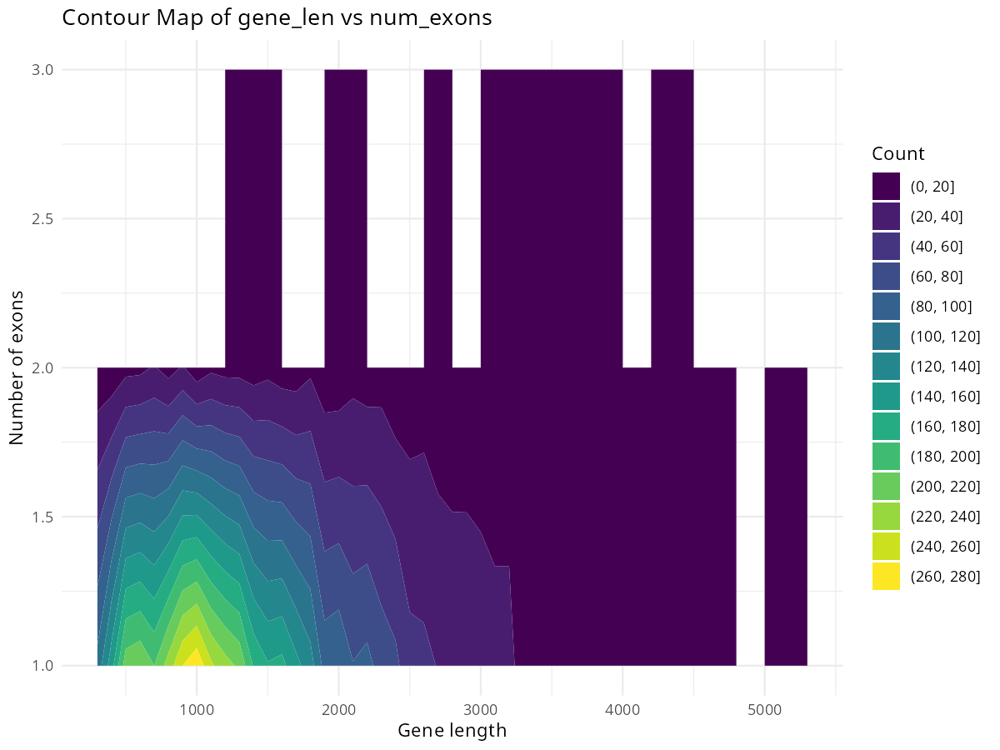
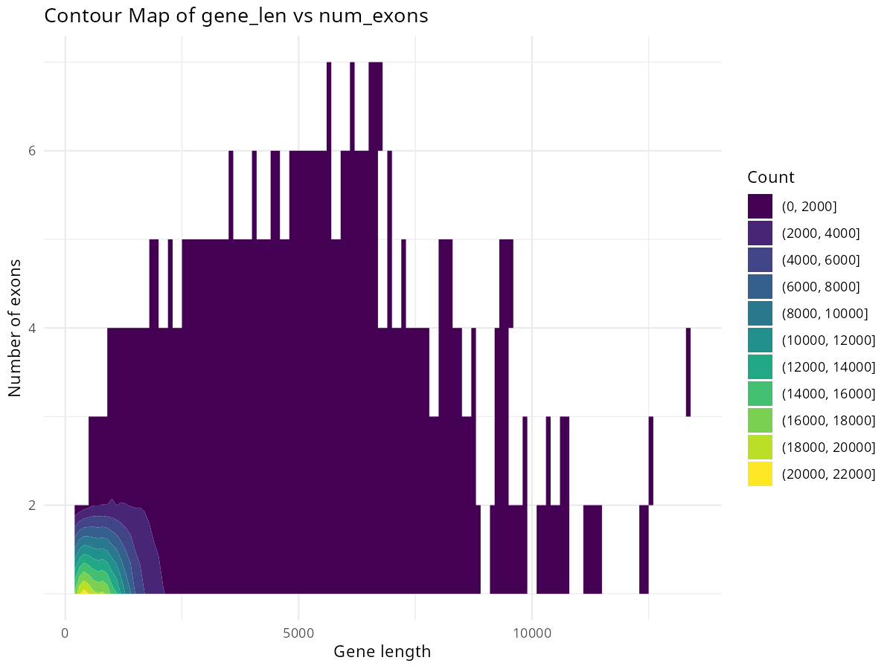

## Discussion Points
1. Examine contigs for coding potential. Hyunmin has done some of this but hasn't presented it to anyone yet.  
<details>
<summary>Deterministic Approach</summary>
        
- Annotated gene features on Bracky_cells contigs (>10 kb) using AUGUSTUS.
- Converted the resulting GFF files to BED12 format, modifying the chromosome field to “chr1” to accommodate genes accumulated across different contigs.
- Visualized the annotated genes in a genome browser.

- Transcript profiles (gene length, exons)
  
| Bracky Blank | Bracky Cells |
| ------- | --------|
|  |  |

- Semi-genome gene shapes (genes with a least 3 exons)


</details>

<details>
        <summary>Probabilistic Approach</summary>

Evo2 Species Prediction Example : Example exons of Bracky_cells_Contigs (selected by the max number of exons )


</details>

2. Look for specific genes common among all vertebrates inside the contigs (for example, histone genes).  
3. Discuss the possibility of detecting DNA damage; normally this requires a reference genome. Can the de novo scaffold work for this, assuming most base pairs are towards the middle of the DNA inserts and therefore not mutated?  

| Alignment | Bracky_cells Contig (>20k)  |
| :-: | :-: |
| Bracky_vessels|  |

4. Revisit known SINE/LINE divergence between reptiles and birds, and come up with a bioinformatic way to test this in our samples.  
5. See if the T-rex cell scaffold is the main target of T-Rex blood vessel DNA reads, as we saw with Brachy (Hyunmin may be working on this already).  
6. Look over centrifuge results with a critical eye: what amount of bp matches are required when finding a match? Why are there so many reads that are "classified" into a clade but not classified into a species?  
7. Make sure the blanks and sediments for all samples are mapping mainly to *Komagataella phaffii*, the primary yeast used for producing recombinant proteins, including DNA polymerases that would have come in the kits used to amplify the libraries.

### Results

** Workflow ** 
```
Ancient DNA Reads
        ↓
De novo Assembly
        ↓
Contigs / Scaffolds
        ↓
----------------------------------------
| 1. Structural Annotation             |
|    → AUGUSTUS gene prediction        |
----------------------------------------
        ↓
----------------------------------------
| 2. Sequence Representation Learning  |
|    → Train / Fine-tune Evo2 model    |
----------------------------------------
        ↓
----------------------------------------
| 3. Functional & Taxonomic Scoring    |
|    → Coding probability              |
|    → Species likelihood score        |
|    → Vertebrate vs contamination     |
----------------------------------------
        ↓
Integrated Evidence:
  - Coding potential
  - Evolutionary signal
  - Species consistency
  - aDNA damage pattern
```
