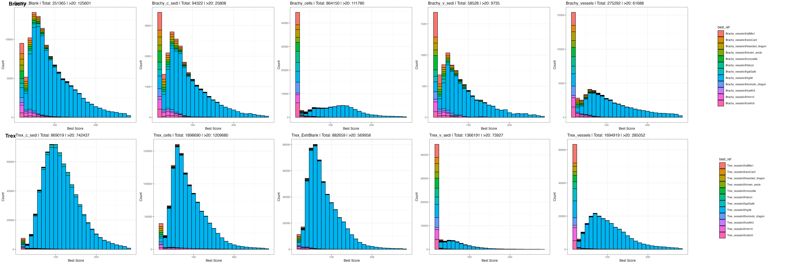
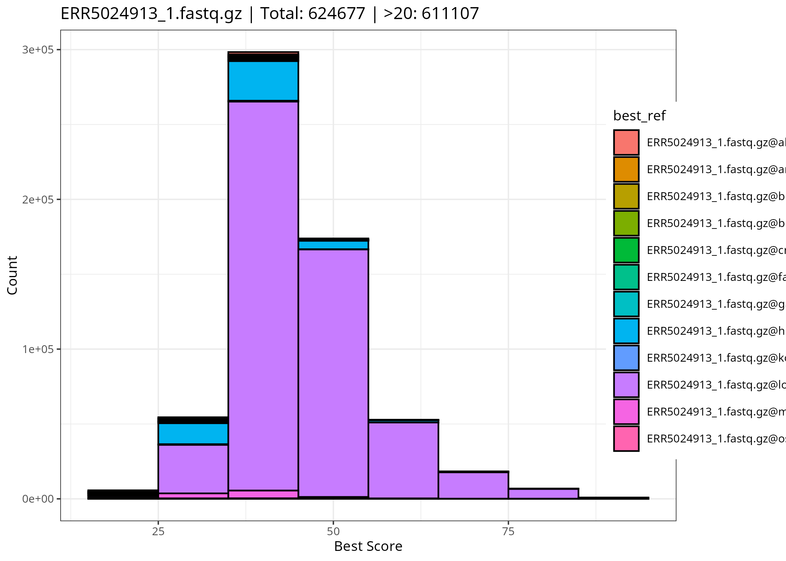

# Fossil-C Bracky & T-rex

### Installation

```
mamba env update -n dino_env -f dino_env.yml
mamba activate dino_env
dino list ## list tools

```

## Goals
### Profiling of FASTQ Read Contents
1. Lengths of trimmed and merged reads
2. Composition of trimmed reads (A/T and G/C repeats, quality metrics)
3. Untreated and unmerged reads

### Profiling of Mapped Alignment Contents
1. Distribution of alignments across target species
2. Mutation patterns in representative species


## Our Approach
>Conventional tools such as EASER and PALEOMIX are designed for aDNA analysis but rely on a reference genome. In our case, only candidate genomes are available, making the challenge far greater than previous efforts.
>Recovering dinosaur aDNA represents one of the most extreme tasks in paleogenomics, requiring highly customized analytical solutions.
>While we adopted the best algorithms from existing literature, the steps between pipelines cannot be fully pre-configured for such data. Instead, we implemented each step individually, rigorously performing QC checks before advancing results to the next stage, ensuring accuracy in this unprecedented context.


### Procedures

1. Adapter handling

```
    00-inspect-barcodes.sh
    00-leehom-rn.sh
``` 

  - [go to results]( results/2025-10-08-read-adapter-positions/README.md  )


2. Preparing Genomes 

```
    00-download-genome.sh # => bigdata/genome
    00-download-ucsc-data.sh # =>bigdata/ucsc
```

3. Mapping Reads

```
    input=(
        bigdata/ucsc/fa/allMis1.fa
        bigdata/ucsc/fa/anoCar2.fa
        bigdata/ucsc/fa/galGal6.fa
        bigdata/ucsc/fa/hg38.fa
        bigdata/ucsc/fa/mm10.fa.gz
        bigdata/ucsc/fa/loxAfr3.fa.gz
        bigdata/genome/bearded_dragon.fna.gz
        bigdata/genome/brown_anole.fna.gz
        bigdata/genome/crocodile.fna.gz
        bigdata/genome/falcon.fna.gz
        bigdata/genome/komodo_dragon.fna.gz
        bigdata/genome/ostrich.fna.gz
    )


    01-bwa-pp.sh  ## preprocessing => bigdata/bwa/idx
    02-bwa-rn.sh  ## mapping to multi species => bigdata/bwa/results
```

4. Bwa Best Scores 

Instead of concatenating the target genomes, we extracted the highest-scoring alignment for each species using:

$$
\text{Score} = \text{matches} - \text{mismatches} - \text{gapopen}
$$

Mismatches include indels, and gap openings are penalized to account for fragmented insertions.

```
Run:
    03-bwa-pl.sh # table of alignment scores => bigdata/bwa_scores/

Output : bigdata/bwa_scores/Bracky_cells.tsv 

id	seq	Brachy_cells@allMis1	Brachy_cells@anoCar2	Brachy_cells@bearded_dragon	Brachy_cells@brown_anole	Brachy_cells@crocodile	Brachy_cells@falcon	Brachy_cells@galGal6	Brachy_cells@hg38	Brachy_cells@komodo_dragon	Brachy_cells@loxAfr3	Brachy_cells@mm10	Brachy_cells@ostrich
LH00333:151:232G25LT3:2:2167:33774:18886	TGGCCCCGGAAGTCGTCGGC	0	0	0	0	0	0	0	0	0	0	16	0
LH00333:151:232G25LT3:2:2176:26174:11745	AAATTTTGCTAAGGATATTTGCGTCAATTTTTATGAAGATTTTATCAAGAATATGGGTTGTAGTTTTCCATTATGATGTCTTTGTTGGAGTAATGCTGGCCT	0	0	0	0	0	0	0	102	0	0	0	0
LH00333:151:232G25LT3:2:1172:50091:21945	CGACAGCGTCGTGACAGCTTC	0	0	0	0	0	0	0	0	0	0	17	17
LH00333:151:232G25LT3:2:1108:51034:4235	GGTCCCGGCCGGCGACCTGCGCGTCGG	0	0	0	0	0	0	0	20	0	0	0	0
LH00333:151:232G25LT3:2:1101:28180:3498	ATCGGAAGATCGTCGTGTAGGGAAA	0	0	0	0	0	0	0	18	0	0	0	0
LH00333:151:232G25LT3:2:1124:11502:18262	GCCCCGCCTCGGCCGCCGCCTGGGTG	0	18	0	0	20	20	0	0	0	0	20	0
LH00333:151:232G25LT3:2:2175:35909:17910	GCACGGCCTCGGCGACGTCGAG	0	0	16	0	0	14	16	0	0	0	0	0
LH00333:151:232G25LT3:2:2189:22171:21721	TACCTTAAGATCGGAAGAGC	0	0	0	0	0	0	0	0	0	0	16	0
LH00333:151:232G25LT3:2:1180:34365:8478	TGAACTCCAGCATCCGTTTC	0	0	0	0	0	0	0	0	0	16	0	0
```

**Summary Plots**



[go details](results/2025-10-16-taxonomic-authentication/README.md)

- All samples contain fragmented human contaminants.
- Cells and Vessels contain fewer human contaminants.
- Small fragments (~20–30 bp) are distributed across multiple species.

**Example:** A Mammoth sequence aligned to the Elephant genome.




### Structure of DATA
<details>
<summary> bigdata (in HPC ) structure </summary>

```text
├── bigdata/adapterrm
│   ├── adapterrm
│   │   ├── Brachy_Blank.html
│   │   ├── Brachy_Blank.json
│   │   ├── Brachy_Blank.merged.fastq.gz
├── bigdata/bwa
│   ├── bwa_scores
│   │   ├── Brachy_Blank_best_score_hist.png
│   │   ├── Brachy_Blank_best_score_stacked.png
│   │   ├── Brachy_Blank.tsv
│   ├── bwa
├── bigdata/bwa_scores
│   ├── bwa_scores
│   │   ├── Brachy_Blank_best_score_hist.png
│   │   ├── Brachy_Blank_best_score_stacked.png
│   │   ├── Brachy_Blank.tsv
├── bigdata/centrifuge
│   ├── centrifuge
│   │   ├── h+p+v+c.tar
│   │   ├── hpvc.1.cf
│   │   ├── hpvc.2.cf
├── bigdata/dn.sh
│   ├── dn.sh
├── bigdata/fastp
│   ├── fastp
│   │   ├── Brachy_Blank_S9_L002_R1_001.fastq.gz
│   │   ├── Brachy_Blank_S9_L002_R1_001.fastq.gz.fastp_report.html
│   │   ├── Brachy_Blank_S9_L002_R2_001.fastq.gz
├── bigdata/gatk
│   ├── gatk
│   │   ├── gatk-4.6.2.0.zip
├── bigdata/genome
│   ├── genome
│   │   ├── bearded_dragon.fna.gz
│   │   ├── brown_anole.fna.gz
│   │   ├── crocodile.fna.gz
├── bigdata/Human
│   ├── Human
│   │   ├── ERR13475326_1.fastq.gz
│   │   ├── ERR13475326_2.fastq.gz
│   │   ├── ERR13475326.fastq.gz
├── bigdata/kr2
│   ├── kr2
│   │   ├── hash.k2d
│   │   ├── opts.k2d
│   │   ├── seqid2taxid.map
├── bigdata/leehom
│   ├── leehom
│   │   ├── Brachy_Blank_r1.fail.fq.gz
│   │   ├── Brachy_Blank_r1.fail.fq.gz.n
│   │   ├── Brachy_Blank_r1.fq.gz
├── bigdata/Mammuthus
│   ├── Mammuthus
│   │   ├── ERR5024913_1.fastq.gz
│   │   ├── ERR5024913_2.fastq.gz
│   │   ├── ERR5032053_1.fastq.gz
├── bigdata/mapdamage
│   ├── mapdamage
├── bigdata/picard.jar
│   ├── picard.jar
├── bigdata/resources
│   ├── resources
│   │   ├── CheckPileup.java
│   │   ├── CountLoci.java
│   │   ├── CountReads.java
├── bigdata/results
│   ├── results
│   │   ├── count_summary.csv
│   │   ├── fail_perc.tsv
│   │   ├── len_distribution.tsv
├── bigdata/stat
│   ├── stat
│   │   ├── Brachy_Blank@allMis1.bed
│   │   ├── Brachy_Blank@galGal6.bed
│   │   ├── Brachy_Blank@hg38.bed
├── bigdata/ucsc
│   ├── ucsc
│   │   ├── genome_info.2bit.urls
│   │   ├── genome_info.fa.urls
│   │   ├── genome_info.json

```
</details>

### Privious Review Points

[plan](plan.md)


