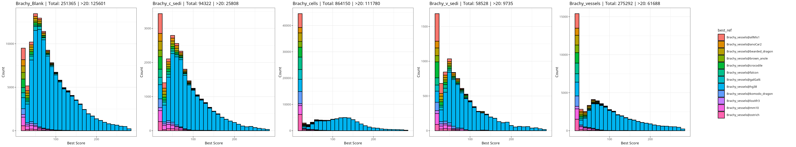
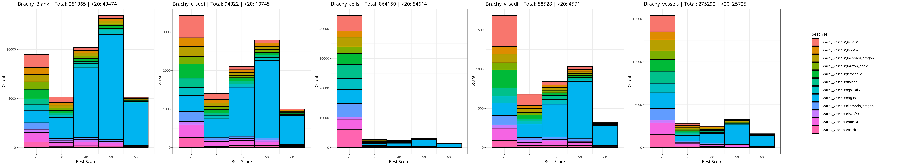
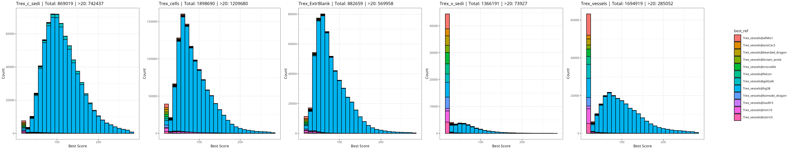
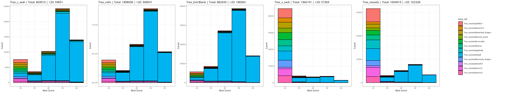

# Fossil-C Bracky & T-rex

### Installation

```
mamba env update -n dino_env -f dino_env.yml
mamba activate dino_env
dino list ## list tools

```

### Procedures

1. Adapter handling

```
    00-inspect-barcodes.sh
    00-leehom-rn.sh
``` 

  - [go to results]( results/2025-10-08-read-adapter-positions/README.md  )


2. Preparing Genomes 

```
    00-download-genome.sh # => bigdata/genome
    00-download-ucsc-data.sh # =>bigdata/ucsc
```

3. Mapping Reads

```
    input=(
        bigdata/ucsc/fa/allMis1.fa
        bigdata/ucsc/fa/anoCar2.fa
        bigdata/ucsc/fa/galGal6.fa
        bigdata/ucsc/fa/hg38.fa
        bigdata/ucsc/fa/mm10.fa.gz
        bigdata/ucsc/fa/loxAfr3.fa.gz
        bigdata/genome/bearded_dragon.fna.gz
        bigdata/genome/brown_anole.fna.gz
        bigdata/genome/crocodile.fna.gz
        bigdata/genome/falcon.fna.gz
        bigdata/genome/komodo_dragon.fna.gz
        bigdata/genome/ostrich.fna.gz
    )


    01-bwa-pp.sh  ## preprocessing => bigdata/bwa/idx
    02-bwa-rn.sh  ## mapping to multi species => bigdata/bwa/results
```

4. Bwa Best Scores 

Instead of concatenating the target genomes, we extracted the highest-scoring alignment for each species using:

$$
\text{Score} = \text{matches} - \text{mismatches} - \text{gapopen}
$$

Mismatches include indels, and gap openings are penalized to account for fragmented insertions.

```
    03-bwa-pl.sh # table of alignment scores => bigdata/bwa_scores/
```

| Group | png | 
| -- | :-: |
| Bracky |  |
| Bracky : len<60|  |
| Trex |  |
| Trex : len<60|  |

[go details](results/2025-10-16-taxonomic-authentication/README.md)

- All samples contain fragmented human contaminants.
- Cells and Vessels contain fewer human contaminants.
- Small fragments (~20–30 bp) are distributed across multiple species.

Example of Mammoth mapped to Elephant:


```

### Structure of DATA
<details>
<summary> bigdata (not shown here ) structure </summary>

```text

    bigdata/
    ├── adapterrm
    ├── bwa
    │   ├── idx
    │   └── results
    ├── centrifuge
    │   └── library
    │       └── contaminants
    ├── fastp
    ├── gatk
    │   └── gatk-4.6.2.0
    │       ├── gatkdoc
    │       └── scripts
    │           ├── cnv_wdl
    │           │   ├── germline
    │           │   └── somatic
    │           ├── mutect2_wdl
    │           │   └── mutect_resources_json
    │           └── sv
    │               └── stepByStep
    ├── genome
    ├── Human
    ├── kr2
    │   ├── genome
    │   │   └── plasmid
    │   ├── library
    │   │   ├── added
    │   │   ├── archaea
    │   │   ├── bacteria
    │   │   ├── fungi
    │   │   ├── human
    │   │   ├── protozoa
    │   │   ├── UniVec_Core
    │   │   └── viral
    │   ├── results
    │   └── taxonomy
    ├── leehom
    ├── Mammuthus
    ├── resources
    ├── results
    ├── stat
    ├── tmp
    │   └── genomes
    └── ucsc
        ├── 2bit
        ├── anno
        │   ├── allMis1
        │   ├── anoCar2
        │   ├── galGal6
        │   └── hg38
        └── fa
```
</details>

### Privious Review Criteria 
[plan](plan.md)


