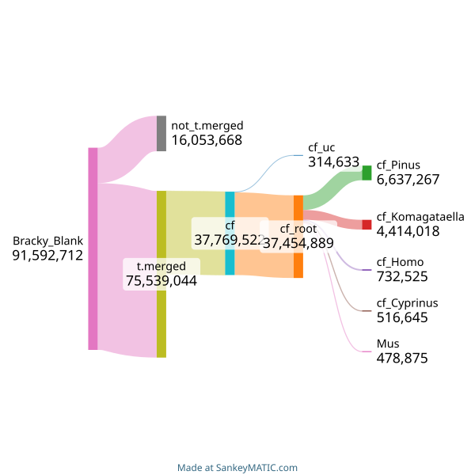
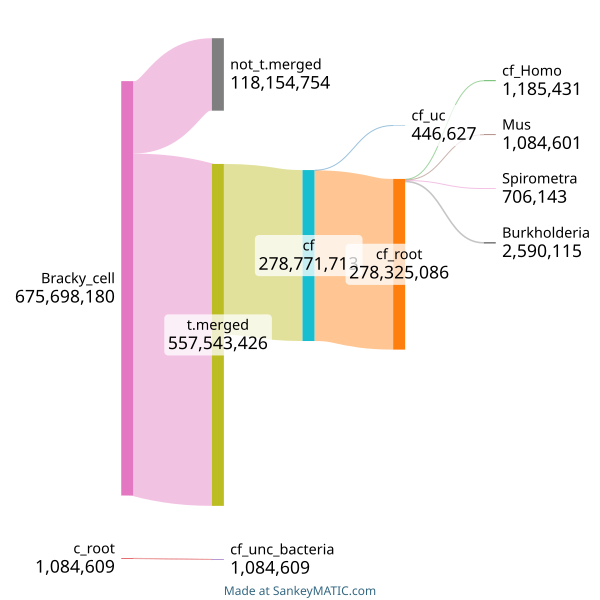
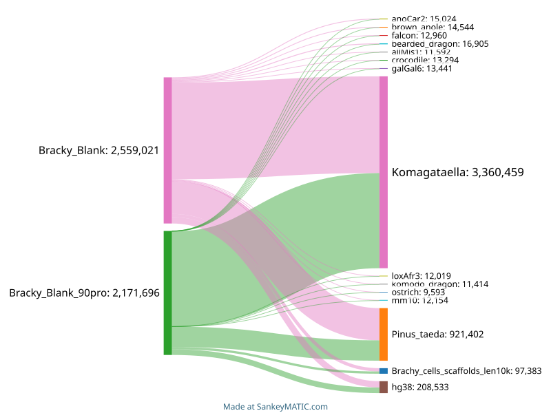
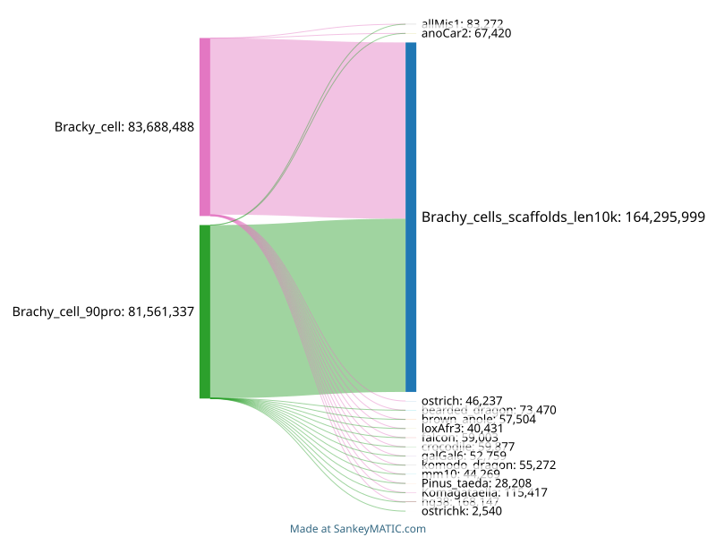
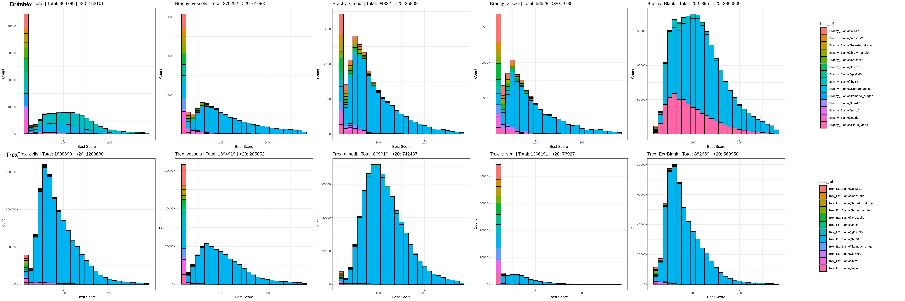
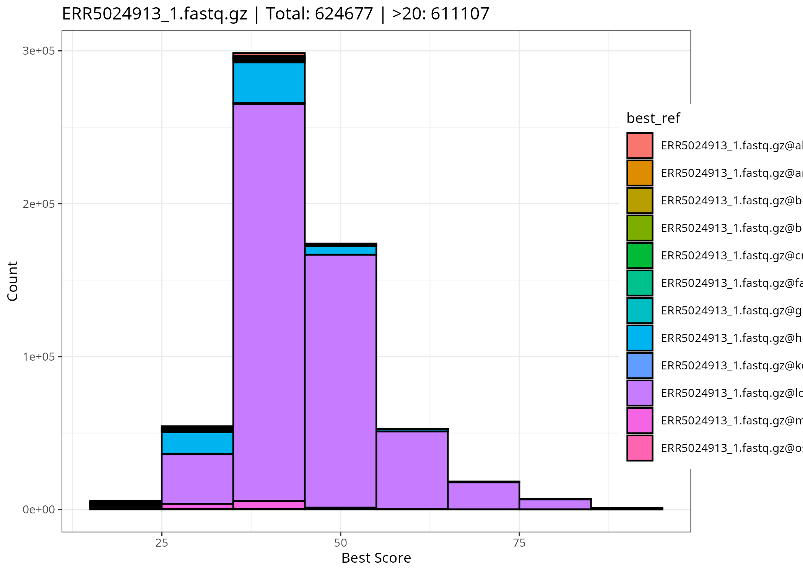

# Fossil-C Bracky & T-rex
## Problem
Challenges in Authentication
```
 Ancient DNA, A 
 [ chicken-like | crocodile-like | unique | damage ] 

 
```
## Summary
### Pipelines
```
[ raw reads ] 
     | leehom 
[ merge reads ] 
     | spade     \ centrifuge
[ contig  ]      [ species assignment ] 
     | bwa build     \
[ bwa idx ]           [ results ]
     | bwa aln
[ bwa species] 
      |
[ results ]
```
### Add Contigs in the BWA score commpetition

> selected Bracky_cells contigs (len>10k) 

### Bracky_Blank Read-History 
 |Methods |Bracky Blank | Bracky Cells |
 |--- |----|----|
 | centrifuge |  |  |
 | bwa |  |  |

<details>
<summary>Sankey input</summary>

```
Bracky_Blank  [16053668] not_t.merged
Bracky_Blank  [75539044 ] t.merged
t.merged [ 37769522 ] cf
cf [314633] cf_uc
cf [37454889] cf_root
cf_root [6637267] cf_Pinus
cf_root [4414018] cf_Komagataella
cf_root [732525] cf_Homo
cf_root [516645] cf_Cyprinus
cf_root [478875] Mus


Bracky_cell  [118154754] not_t.merged
Bracky_cell  [557543426 ] t.merged
t.merged [ 278771713 ] cf
cf [446627 ] cf_uc
cf [278325086] cf_root
cf_root [1185431] cf_Homo
c_root [1084609] cf_unc_bacteria
cf_root [1084601] Mus
cf_root [706143] Spirometra
cf_root [2590115] Burkholderia


Bracky_Blank [10736 ] allMis1
Bracky_Blank [14261 ] anoCar2
Bracky_Blank [15774 ] bearded_dragon
Bracky_Blank [57337 ] Brachy_cells_scaffolds_len10k
Bracky_Blank [13860 ] brown_anole
Bracky_Blank [12089 ] crocodile
Bracky_Blank [12283 ] falcon
Bracky_Blank [11610 ] galGal6
Bracky_Blank [110136 ] hg38
Bracky_Blank [1694252 ] Komagataella
Bracky_Blank [10577 ] komodo_dragon
Bracky_Blank [11442 ] loxAfr3
Bracky_Blank [11041 ] mm10
Bracky_Blank [8895 ] ostrich
Bracky_Blank [564728 ] Pinus_taeda

Bracky_Blank_90pro [ 40046] Brachy_cells_scaffolds_len10k
Bracky_Blank_90pro [ 1666207] Komagataella
Bracky_Blank_90pro [ 356674] Pinus_taeda
Bracky_Blank_90pro [ 856] allMis1
Bracky_Blank_90pro [ 763] anoCar2
Bracky_Blank_90pro [ 1131] bearded_dragon
Bracky_Blank_90pro [ 684] brown_anole
Bracky_Blank_90pro [ 1205] crocodile
Bracky_Blank_90pro [ 677] falcon
Bracky_Blank_90pro [ 1831] galGal6
Bracky_Blank_90pro [ 98397] hg38
Bracky_Blank_90pro [ 837] komodo_dragon
Bracky_Blank_90pro [ 577] loxAfr3
Bracky_Blank_90pro [ 1113] mm10
Bracky_Blank_90pro [ 698] ostrich

Bracky_cell [ 81084] allMis1
Bracky_cell [ 65501] anoCar2
Bracky_cell [ 71002] bearded_dragon
Bracky_cell [ 82859630] Brachy_cells_scaffolds_len10k
Bracky_cell [ 55619] brown_anole
Bracky_cell [ 57523] crocodile
Bracky_cell [ 56785] falcon
Bracky_cell [ 50590] galGal6
Bracky_cell [ 107855] hg38
Bracky_cell [ 77140] Komagataella
Bracky_cell [ 52566] komodo_dragon
Bracky_cell [ 39047] loxAfr3
Bracky_cell [ 41878] mm10
Bracky_cell [ 46237] ostrich
Bracky_cell [ 26031] Pinus_taeda

Brachy_cell_90pro [81436369] Brachy_cells_scaffolds_len10k
Brachy_cell_90pro [38277] Komagataella
Brachy_cell_90pro [2177] Pinus_taeda
Brachy_cell_90pro [2188] allMis1
Brachy_cell_90pro [1919] anoCar2
Brachy_cell_90pro [2468] bearded_dragon
Brachy_cell_90pro [1885] brown_anole
Brachy_cell_90pro [2354] crocodile
Brachy_cell_90pro [2218] falcon
Brachy_cell_90pro [2169] galGal6
Brachy_cell_90pro [60292] hg38
Brachy_cell_90pro [2706] komodo_dragon
Brachy_cell_90pro [1384] loxAfr3
Brachy_cell_90pro [2391] mm10
Brachy_cell_90pro [2540] ostrichk
```

</details>

## Installation
```
mamba env update -n dino_env -f dino_env.yml
mamba activate dino_env
dino list ## list tools
dino <command> ## help
```
## Goals
### Profiling of FASTQ Read Contents
- [x] Lengths of trimmed and merged reads
- [x] Composition of trimmed reads (A/T and G/C repeats, quality metrics)
- [x] Untreated and unmerged reads

### Authenticating Ancient DNA Signatures
- [x] Anonymous K-mer mapping
- [x] Alignment Distributions across target species
- [ ] Mutation Damage Profiling 

## Our Approach: A Customized Framework for Ultra-Degraded aDNA
>Conventional tools such as EASER and PALEOMIX are designed for aDNA analysis but rely on a reference genome. In our case, only candidate genomes are available, making the challenge far greater than previous efforts.
>Recovering dinosaur aDNA represents one of the most extreme tasks in paleogenomics, requiring highly customized analytical solutions.
>While we adopted the best algorithms from existing literature, the steps between pipelines cannot be fully pre-configured for such data. Instead, we implemented each step individually, rigorously performing QC checks before advancing results to the next stage, ensuring accuracy in this unprecedented context.

- trim fastq
- align k-mers to known genomes
- align the reads to the target speies

### Procedures

1. Adapter handling

```
    00-inspect-barcodes.sh
    00-leehom-rn.sh
``` 

  - [go to results]( results/2025-10-08-read-adapter-positions/README.md  )


2. Preparing Genomes 

```
    00-download-genome.sh # => bigdata/genome
    00-download-ucsc-data.sh # =>bigdata/ucsc
```

3. Mapping Reads

```
    input=(
        bigdata/ucsc/fa/allMis1.fa
        bigdata/ucsc/fa/anoCar2.fa
        bigdata/ucsc/fa/galGal6.fa
        bigdata/ucsc/fa/hg38.fa
        bigdata/ucsc/fa/mm10.fa.gz
        bigdata/ucsc/fa/loxAfr3.fa.gz
        bigdata/genome/bearded_dragon.fna.gz
        bigdata/genome/brown_anole.fna.gz
        bigdata/genome/crocodile.fna.gz
        bigdata/genome/falcon.fna.gz
        bigdata/genome/komodo_dragon.fna.gz
        bigdata/genome/ostrich.fna.gz
    )


    01-bwa-pp.sh  ## preprocessing => bigdata/bwa/idx
    02-bwa-rn.sh  ## mapping to multi species => bigdata/bwa/results
```

4. Bwa Best Scores 

Instead of concatenating the target genomes, we extracted the highest-scoring alignment for each species using:

$$
\text{Score} = \text{matches} - \text{mismatches} - \text{gapopen}
$$

Mismatches include indels, and gap openings are penalized to account for fragmented insertions.

```
Run:
    03-bwa-pl.sh # table of alignment scores => bigdata/bwa_scores/

Output : bigdata/bwa_scores/Bracky_cells.tsv 

id	seq	Brachy_cells@allMis1	Brachy_cells@anoCar2	Brachy_cells@bearded_dragon	Brachy_cells@brown_anole	Brachy_cells@crocodile	Brachy_cells@falcon	Brachy_cells@galGal6	Brachy_cells@hg38	Brachy_cells@komodo_dragon	Brachy_cells@loxAfr3	Brachy_cells@mm10	Brachy_cells@ostrich
LH00333:151:232G25LT3:2:2167:33774:18886	TGGCCCCGGAAGTCGTCGGC	0	0	0	0	0	0	0	0	0	0	16	0
LH00333:151:232G25LT3:2:2176:26174:11745	AAATTTTGCTAAGGATATTTGCGTCAATTTTTATGAAGATTTTATCAAGAATATGGGTTGTAGTTTTCCATTATGATGTCTTTGTTGGAGTAATGCTGGCCT	0	0	0	0	0	0	0	102	0	0	0	0
LH00333:151:232G25LT3:2:1172:50091:21945	CGACAGCGTCGTGACAGCTTC	0	0	0	0	0	0	0	0	0	0	17	17
LH00333:151:232G25LT3:2:1108:51034:4235	GGTCCCGGCCGGCGACCTGCGCGTCGG	0	0	0	0	0	0	0	20	0	0	0	0
LH00333:151:232G25LT3:2:1101:28180:3498	ATCGGAAGATCGTCGTGTAGGGAAA	0	0	0	0	0	0	0	18	0	0	0	0
LH00333:151:232G25LT3:2:1124:11502:18262	GCCCCGCCTCGGCCGCCGCCTGGGTG	0	18	0	0	20	20	0	0	0	0	20	0
LH00333:151:232G25LT3:2:2175:35909:17910	GCACGGCCTCGGCGACGTCGAG	0	0	16	0	0	14	16	0	0	0	0	0
LH00333:151:232G25LT3:2:2189:22171:21721	TACCTTAAGATCGGAAGAGC	0	0	0	0	0	0	0	0	0	0	16	0
LH00333:151:232G25LT3:2:1180:34365:8478	TGAACTCCAGCATCCGTTTC	0	0	0	0	0	0	0	0	0	16	0	0
```

**Summary Plots**



[go details](results/2025-10-16-taxonomic-authentication/README.md)

- All samples contain fragmented human contaminants.
- Cells and Vessels contain fewer human contaminants.
- Small fragments (~20–30 bp) are distributed across multiple species.

**Example:** A Mammoth sequence aligned to the Elephant genome.




### Structure of DATA
<details>
<summary> bigdata (in HPC ) structure </summary>

```text
├── bigdata/adapterrm
│   ├── adapterrm
│   │   ├── Brachy_Blank.html
│   │   ├── Brachy_Blank.json
│   │   ├── Brachy_Blank.merged.fastq.gz
├── bigdata/bwa
│   ├── bwa_scores
│   │   ├── Brachy_Blank_best_score_hist.png
│   │   ├── Brachy_Blank_best_score_stacked.png
│   │   ├── Brachy_Blank.tsv
│   ├── bwa
├── bigdata/bwa_scores
│   ├── bwa_scores
│   │   ├── Brachy_Blank_best_score_hist.png
│   │   ├── Brachy_Blank_best_score_stacked.png
│   │   ├── Brachy_Blank.tsv
├── bigdata/centrifuge
│   ├── centrifuge
│   │   ├── h+p+v+c.tar
│   │   ├── hpvc.1.cf
│   │   ├── hpvc.2.cf
├── bigdata/dn.sh
│   ├── dn.sh
├── bigdata/fastp
│   ├── fastp
│   │   ├── Brachy_Blank_S9_L002_R1_001.fastq.gz
│   │   ├── Brachy_Blank_S9_L002_R1_001.fastq.gz.fastp_report.html
│   │   ├── Brachy_Blank_S9_L002_R2_001.fastq.gz
├── bigdata/gatk
│   ├── gatk
│   │   ├── gatk-4.6.2.0.zip
├── bigdata/genome
│   ├── genome
│   │   ├── bearded_dragon.fna.gz
│   │   ├── brown_anole.fna.gz
│   │   ├── crocodile.fna.gz
├── bigdata/Human
│   ├── Human
│   │   ├── ERR13475326_1.fastq.gz
│   │   ├── ERR13475326_2.fastq.gz
│   │   ├── ERR13475326.fastq.gz
├── bigdata/kr2
│   ├── kr2
│   │   ├── hash.k2d
│   │   ├── opts.k2d
│   │   ├── seqid2taxid.map
├── bigdata/leehom
│   ├── leehom
│   │   ├── Brachy_Blank_r1.fail.fq.gz
│   │   ├── Brachy_Blank_r1.fail.fq.gz.n
│   │   ├── Brachy_Blank_r1.fq.gz
├── bigdata/Mammuthus
│   ├── Mammuthus
│   │   ├── ERR5024913_1.fastq.gz
│   │   ├── ERR5024913_2.fastq.gz
│   │   ├── ERR5032053_1.fastq.gz
├── bigdata/mapdamage
│   ├── mapdamage
├── bigdata/picard.jar
│   ├── picard.jar
├── bigdata/resources
│   ├── resources
│   │   ├── CheckPileup.java
│   │   ├── CountLoci.java
│   │   ├── CountReads.java
├── bigdata/results
│   ├── results
│   │   ├── count_summary.csv
│   │   ├── fail_perc.tsv
│   │   ├── len_distribution.tsv
├── bigdata/stat
│   ├── stat
│   │   ├── Brachy_Blank@allMis1.bed
│   │   ├── Brachy_Blank@galGal6.bed
│   │   ├── Brachy_Blank@hg38.bed
├── bigdata/ucsc
│   ├── ucsc
│   │   ├── genome_info.2bit.urls
│   │   ├── genome_info.fa.urls
│   │   ├── genome_info.json

```
</details>

### Privious Review Points

[plan](plan.md)


