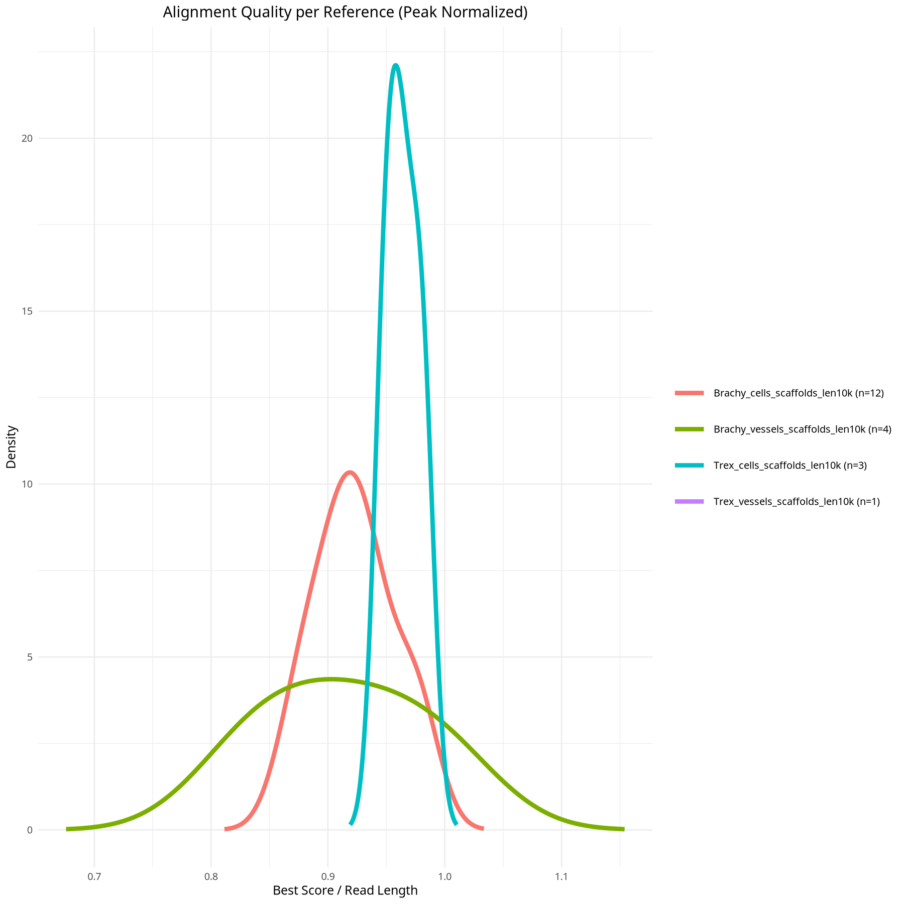
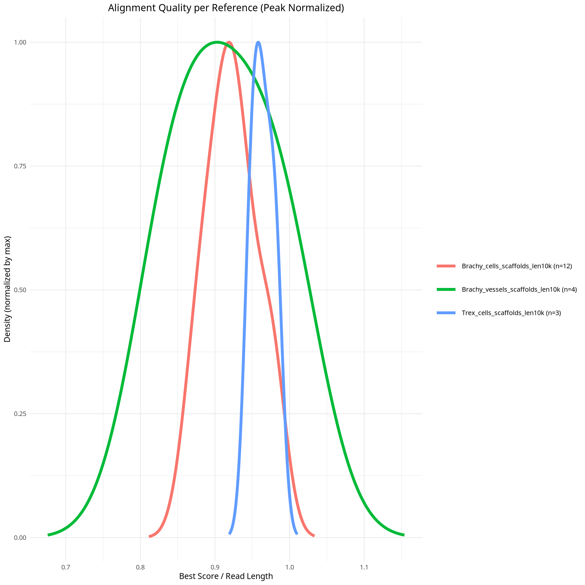
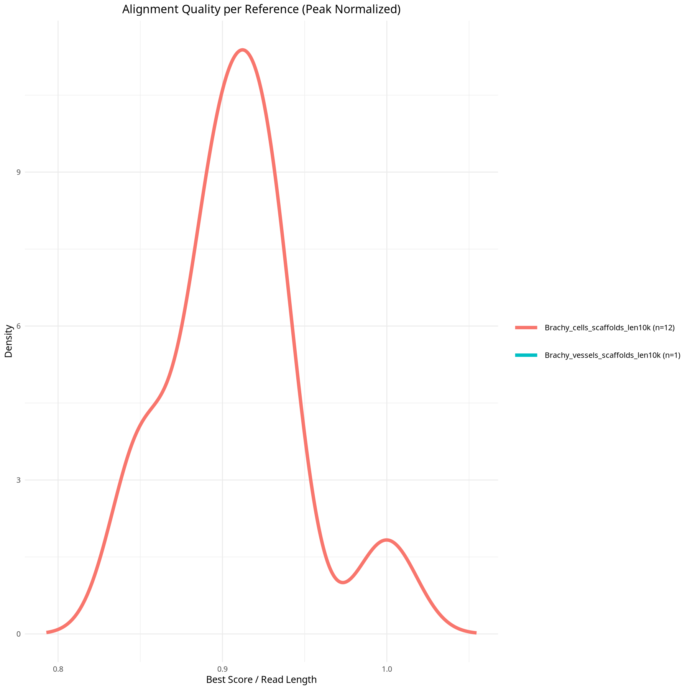
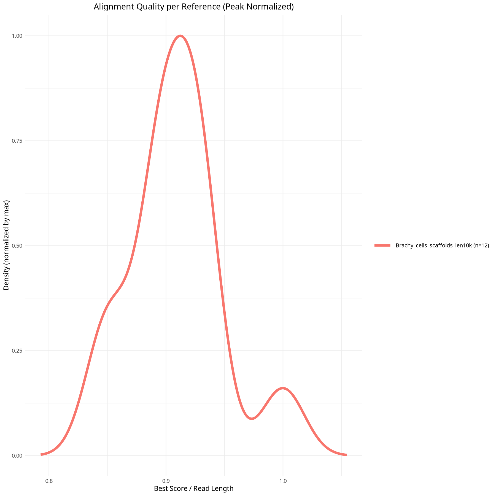
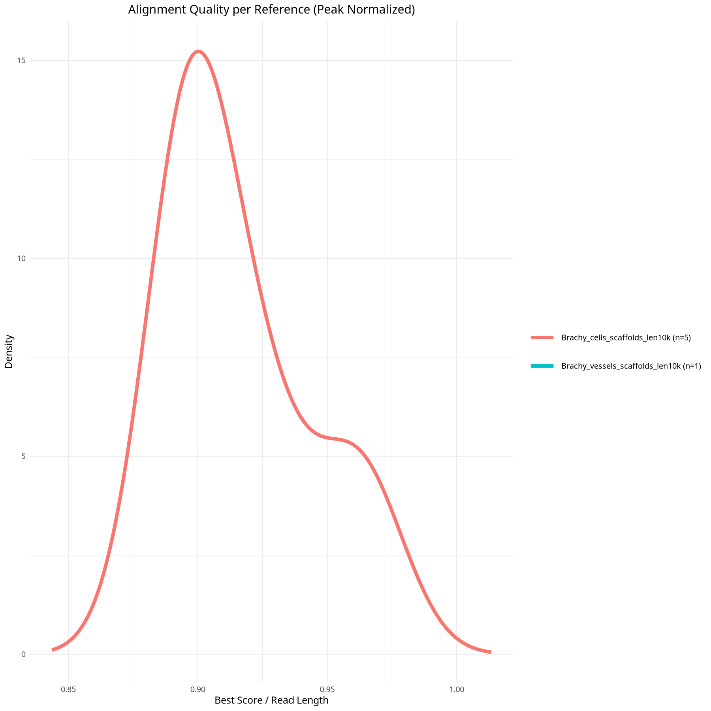
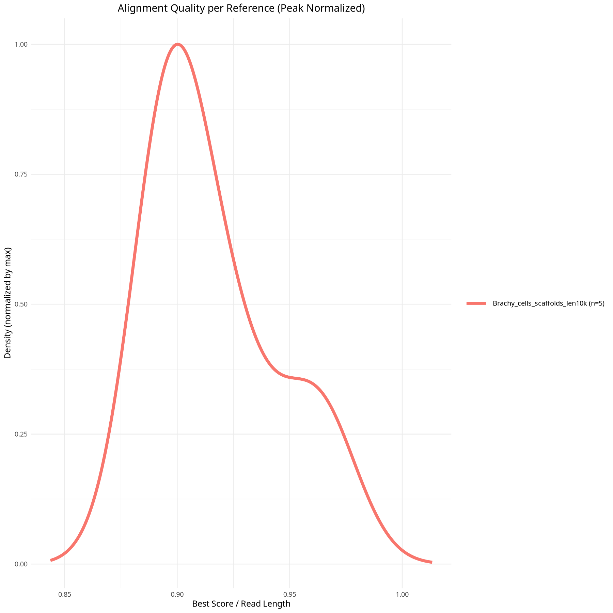

## Mapping Summary 

[FHU_D16_B03p_no-hit.tsv](bwa_scores/FHU_D16_B03p_no-hit.tsv)
[FHU_D16_B04p_no-hit.tsv](bwa_scores/FHU_D16_B04p_no-hit.tsv)
[FHU_D16_B05p_no-hit.tsv](bwa_scores/FHU_D16_B05p_no-hit.tsv)

## Mapping proportion

| Sample | Proportion | Max Norm |
|------|------|------|
| FHU_D16_B03p |  |  |
| FHU_D16_B04p |  |  |
| FHU_D16_B05p |  |  |
