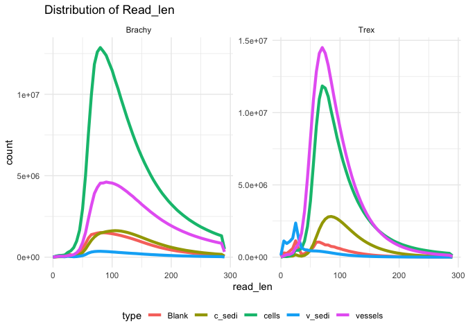
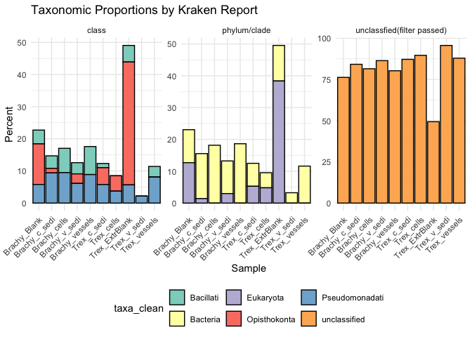

## Trimmed and Pair-Merged Read Lengths

-   Reads were merged using LeeHom

## Kraken2 Contamination Report

<table>
<caption>Kraken report: domain proportions by sample</caption>
<colgroup>
<col style="width: 21%" />
<col style="width: 13%" />
<col style="width: 65%" />
</colgroup>
<thead>
<tr class="header">
<th>Taxa</th>
<th style="text-align: center;">Included</th>
<th>Description</th>
</tr>
</thead>
<tbody>
<tr class="odd">
<td>Archaea</td>
<td style="text-align: center;">✅</td>
<td>Single-celled microorganisms distinct from bacteria</td>
</tr>
<tr class="even">
<td>Bacteria</td>
<td style="text-align: center;">✅</td>
<td>Prokaryotic microorganisms</td>
</tr>
<tr class="odd">
<td>Human</td>
<td style="text-align: center;">✅</td>
<td>Host genome sequences</td>
</tr>
<tr class="even">
<td>Plasmid</td>
<td style="text-align: center;">✅</td>
<td>Extrachromosomal DNA elements</td>
</tr>
<tr class="odd">
<td>Viral</td>
<td style="text-align: center;">✅</td>
<td>Viruses including phages</td>
</tr>
<tr class="even">
<td>Fungi</td>
<td style="text-align: center;">✅</td>
<td>Eukaryotic organisms such as yeasts and molds</td>
</tr>
<tr class="odd">
<td>Plant</td>
<td style="text-align: center;">❌</td>
<td>Plant sequences (commented out / optional)</td>
</tr>
<tr class="even">
<td>Protozoa</td>
<td style="text-align: center;">✅</td>
<td>Single-celled eukaryotes</td>
</tr>
<tr class="odd">
<td>UniVec</td>
<td style="text-align: center;">✅</td>
<td>Vector contamination sequences</td>
</tr>
<tr class="even">
<td>UniVec_Core</td>
<td style="text-align: center;">✅</td>
<td>Core vector sequences</td>
</tr>
</tbody>
</table>

Kraken report: domain proportions by sample

<table>
<colgroup>
<col style="width: 13%" />
<col style="width: 11%" />
<col style="width: 12%" />
<col style="width: 14%" />
<col style="width: 17%" />
<col style="width: 18%" />
<col style="width: 11%" />
</colgroup>
<thead>
<tr class="header">
<th style="text-align: left;">sample</th>
<th style="text-align: right;">____Bacteria</th>
<th style="text-align: right;">____Eukaryota</th>
<th style="text-align: right;">______Bacillati</th>
<th style="text-align: right;">______Opisthokonta</th>
<th style="text-align: right;">______Pseudomonadati</th>
<th style="text-align: right;">unclassified</th>
</tr>
</thead>
<tbody>
<tr class="odd">
<td style="text-align: left;">Brachy_Blank</td>
<td style="text-align: right;">10.36</td>
<td style="text-align: right;">12.69</td>
<td style="text-align: right;">4.29</td>
<td style="text-align: right;">12.63</td>
<td style="text-align: right;">5.79</td>
<td style="text-align: right;">76.24</td>
</tr>
<tr class="even">
<td style="text-align: left;">Brachy_c_sedi</td>
<td style="text-align: right;">14.12</td>
<td style="text-align: right;">1.42</td>
<td style="text-align: right;">3.90</td>
<td style="text-align: right;">1.41</td>
<td style="text-align: right;">9.38</td>
<td style="text-align: right;">84.18</td>
</tr>
<tr class="odd">
<td style="text-align: left;">Brachy_cells</td>
<td style="text-align: right;">18.17</td>
<td style="text-align: right;">0.00</td>
<td style="text-align: right;">7.57</td>
<td style="text-align: right;">0.00</td>
<td style="text-align: right;">9.47</td>
<td style="text-align: right;">81.47</td>
</tr>
<tr class="even">
<td style="text-align: left;">Brachy_v_sedi</td>
<td style="text-align: right;">10.25</td>
<td style="text-align: right;">2.99</td>
<td style="text-align: right;">3.49</td>
<td style="text-align: right;">2.96</td>
<td style="text-align: right;">6.12</td>
<td style="text-align: right;">86.39</td>
</tr>
<tr class="odd">
<td style="text-align: left;">Brachy_vessels</td>
<td style="text-align: right;">18.64</td>
<td style="text-align: right;">0.00</td>
<td style="text-align: right;">8.72</td>
<td style="text-align: right;">0.00</td>
<td style="text-align: right;">8.87</td>
<td style="text-align: right;">80.26</td>
</tr>
<tr class="even">
<td style="text-align: left;">Trex_ExtrBlank</td>
<td style="text-align: right;">11.17</td>
<td style="text-align: right;">38.35</td>
<td style="text-align: right;">5.15</td>
<td style="text-align: right;">38.23</td>
<td style="text-align: right;">5.66</td>
<td style="text-align: right;">49.36</td>
</tr>
<tr class="odd">
<td style="text-align: left;">Trex_c_sedi</td>
<td style="text-align: right;">7.21</td>
<td style="text-align: right;">5.28</td>
<td style="text-align: right;">1.32</td>
<td style="text-align: right;">5.25</td>
<td style="text-align: right;">5.76</td>
<td style="text-align: right;">87.19</td>
</tr>
<tr class="even">
<td style="text-align: left;">Trex_cells</td>
<td style="text-align: right;">4.74</td>
<td style="text-align: right;">4.80</td>
<td style="text-align: right;">0.00</td>
<td style="text-align: right;">4.77</td>
<td style="text-align: right;">3.73</td>
<td style="text-align: right;">89.61</td>
</tr>
<tr class="odd">
<td style="text-align: left;">Trex_v_sedi</td>
<td style="text-align: right;">3.25</td>
<td style="text-align: right;">0.00</td>
<td style="text-align: right;">0.00</td>
<td style="text-align: right;">0.00</td>
<td style="text-align: right;">2.18</td>
<td style="text-align: right;">95.62</td>
</tr>
<tr class="even">
<td style="text-align: left;">Trex_vessels</td>
<td style="text-align: right;">11.62</td>
<td style="text-align: right;">0.00</td>
<td style="text-align: right;">3.31</td>
<td style="text-align: right;">0.00</td>
<td style="text-align: right;">8.09</td>
<td style="text-align: right;">87.89</td>
</tr>
</tbody>
</table>

