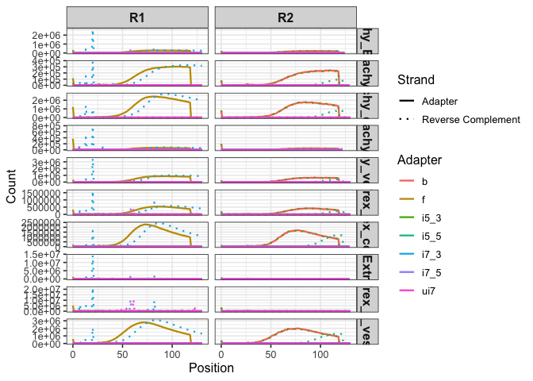

## Barcode and Adapter Structure

**Design**

    Xs = i7 index sequence
    5′-CAAGCAGAAGACGGCATACGAGATNNNNNNNNNXXXXXXXXGTGACTGGAGTTCAGACGTGT-3′

    Forward Index Primer Sequence (i5)
    5′-AATGATACGGCGACCACCGAGATCTACACXXXXXXXXACACTCTTTCCCTACACGACGCTCTTCCGATCT-3′

    Reverse Index Primer Sequence (Ui7)
    #5′-CAAGCAGAAGACGGCATACGA-3′

**Fasta**

    >f
    AGATCGGAAGAGCACACGTCTGAACTCCAGTCA
    >b
    AGATCGGAAGAGCGTCGTGTAGGGAAAGAGTGT
    >i7_5
    CAAGCAGAAGACGGCATACGAGAT
    >i7_3
    GTGACTGGAGTTCAGACGTGT
    >i5_5
    AATGATACGGCGACCACCGAGATCTACAC
    >i5_3
    ACACTCTTTCCCTACACGACGCTCTTCCGATCT
    >ui7
    CAAGCAGAAGACGGCATACGA   

### Adapter Distribution

    ## Warning: package 'data.table' was built under R version 4.4.3

    ## Warning: package 'ggplot2' was built under R version 4.4.3

    ## 
    ## Attaching package: 'dplyr'

    ## The following objects are masked from 'package:data.table':
    ## 
    ##     between, first, last

    ## The following objects are masked from 'package:stats':
    ## 
    ##     filter, lag

    ## The following objects are masked from 'package:base':
    ## 
    ##     intersect, setdiff, setequal, union

    ## Warning: Using `size` aesthetic for lines was deprecated in ggplot2 3.4.0.
    ## ℹ Please use `linewidth` instead.
    ## This warning is displayed once every 8 hours.
    ## Call `lifecycle::last_lifecycle_warnings()` to see where this warning was generated.

[PDF](adapter.pdf)
