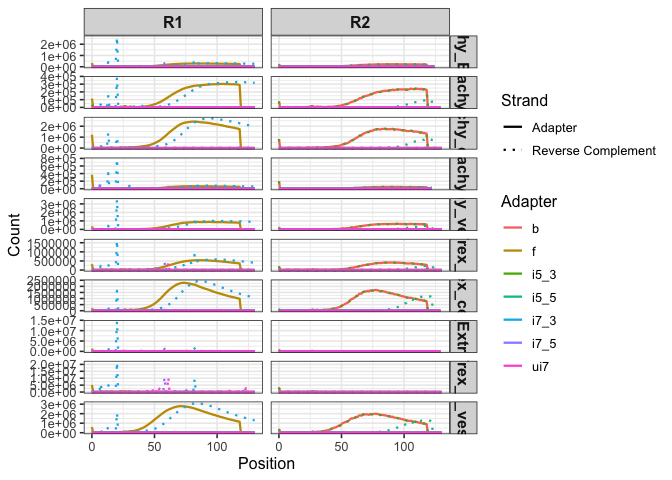

## Barcode and Adapter Structure

**Design**

    Xs = i7 index sequence
    5′-CAAGCAGAAGACGGCATACGAGATNNNNNNNNNXXXXXXXXGTGACTGGAGTTCAGACGTGT-3′

    Forward Index Primer Sequence (i5)
    5′-AATGATACGGCGACCACCGAGATCTACACXXXXXXXXACACTCTTTCCCTACACGACGCTCTTCCGATCT-3′

    Reverse Index Primer Sequence (Ui7)
    #5′-CAAGCAGAAGACGGCATACGA-3′

**Fasta**

    >f
    AGATCGGAAGAGCACACGTCTGAACTCCAGTCA
    >b
    AGATCGGAAGAGCGTCGTGTAGGGAAAGAGTGT
    >i7_5
    CAAGCAGAAGACGGCATACGAGAT
    >i7_3
    GTGACTGGAGTTCAGACGTGT
    >i5_5
    AATGATACGGCGACCACCGAGATCTACAC
    >i5_3
    ACACTCTTTCCCTACACGACGCTCTTCCGATCT
    >ui7
    CAAGCAGAAGACGGCATACGA   

### Adapter Distribution

    ## [PDF](adapter.pdf)
