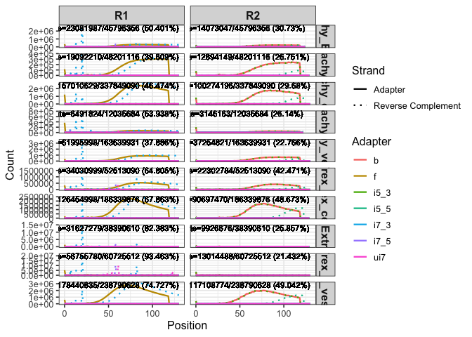
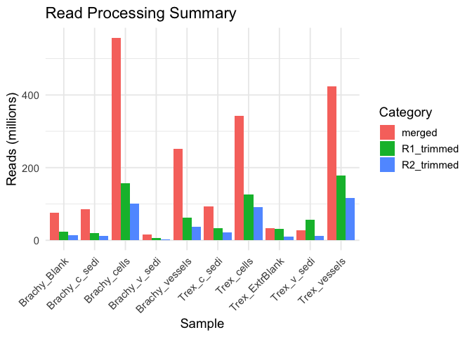

## Read Count Summary

<table>
<colgroup>
<col style="width: 18%" />
<col style="width: 15%" />
<col style="width: 12%" />
<col style="width: 13%" />
<col style="width: 12%" />
<col style="width: 13%" />
<col style="width: 12%" />
</colgroup>
<thead>
<tr>
<th style="text-align: left;">sample</th>
<th style="text-align: right;">total_reads</th>
<th style="text-align: right;">R1_total</th>
<th style="text-align: right;">R1_trimmed</th>
<th style="text-align: right;">R2_total</th>
<th style="text-align: right;">R2_trimmed</th>
<th style="text-align: right;">merged</th>
</tr>
</thead>
<tbody>
<tr>
<td style="text-align: left;">Brachy_Blank</td>
<td style="text-align: right;">91592712</td>
<td style="text-align: right;">45796356</td>
<td style="text-align: right;">23081987</td>
<td style="text-align: right;">45796356</td>
<td style="text-align: right;">14073047</td>
<td style="text-align: right;">75539044</td>
</tr>
<tr>
<td style="text-align: left;">Brachy_cells</td>
<td style="text-align: right;">675698180</td>
<td style="text-align: right;">337849090</td>
<td style="text-align: right;">157010629</td>
<td style="text-align: right;">337849090</td>
<td style="text-align: right;">100274196</td>
<td style="text-align: right;">557543426</td>
</tr>
<tr>
<td style="text-align: left;">Brachy_c_sedi</td>
<td style="text-align: right;">96402232</td>
<td style="text-align: right;">48201116</td>
<td style="text-align: right;">19092210</td>
<td style="text-align: right;">48201116</td>
<td style="text-align: right;">12894149</td>
<td style="text-align: right;">84758392</td>
</tr>
<tr>
<td style="text-align: left;">Brachy_vessels</td>
<td style="text-align: right;">327279862</td>
<td style="text-align: right;">163639931</td>
<td style="text-align: right;">61995998</td>
<td style="text-align: right;">163639931</td>
<td style="text-align: right;">37254821</td>
<td style="text-align: right;">252107444</td>
</tr>
<tr>
<td style="text-align: left;">Brachy_v_sedi</td>
<td style="text-align: right;">24071368</td>
<td style="text-align: right;">12035684</td>
<td style="text-align: right;">6491824</td>
<td style="text-align: right;">12035684</td>
<td style="text-align: right;">3146163</td>
<td style="text-align: right;">16851316</td>
</tr>
<tr>
<td style="text-align: left;">Trex_cells</td>
<td style="text-align: right;">372679752</td>
<td style="text-align: right;">186339876</td>
<td style="text-align: right;">126454998</td>
<td style="text-align: right;">186339876</td>
<td style="text-align: right;">90697470</td>
<td style="text-align: right;">343448472</td>
</tr>
<tr>
<td style="text-align: left;">Trex_c_sedi</td>
<td style="text-align: right;">105026180</td>
<td style="text-align: right;">52513090</td>
<td style="text-align: right;">34030999</td>
<td style="text-align: right;">52513090</td>
<td style="text-align: right;">22302784</td>
<td style="text-align: right;">93201942</td>
</tr>
<tr>
<td style="text-align: left;">Trex_ExtrBlank</td>
<td style="text-align: right;">76781220</td>
<td style="text-align: right;">38390610</td>
<td style="text-align: right;">31627279</td>
<td style="text-align: right;">38390610</td>
<td style="text-align: right;">9926676</td>
<td style="text-align: right;">33627634</td>
</tr>
<tr>
<td style="text-align: left;">Trex_vessels</td>
<td style="text-align: right;">477581256</td>
<td style="text-align: right;">238790628</td>
<td style="text-align: right;">178440835</td>
<td style="text-align: right;">238790628</td>
<td style="text-align: right;">117108774</td>
<td style="text-align: right;">424255104</td>
</tr>
<tr>
<td style="text-align: left;">Trex_v_sedi</td>
<td style="text-align: right;">121451024</td>
<td style="text-align: right;">60725512</td>
<td style="text-align: right;">56755780</td>
<td style="text-align: right;">60725512</td>
<td style="text-align: right;">13014488</td>
<td style="text-align: right;">27812772</td>
</tr>
</tbody>
</table>

[tsv download](summary.tsv)

## Barcode and Adapter Structure

**Design**

    Xs = i7 index sequence
       i7_5                                     i7_3
    5′-CAAGCAGAAGACGGCATACGAGATNNNNNNNNNXXXXXXXXGTGACTGGAGTTCAGACGTGT-3′
                      (rc_i7_5)                             (rc_i5_3 )

    Forward Index Primer Sequence (i5)
       i5_5                                 i5_3
    5′-AATGATACGGCGACCACCGAGATCTACACXXXXXXXXACACTCTTTCCCTACACGACGCTCTTCCGATCT-3′
                            (rc_i5_5)                                (rc_i5_3)

    Reverse Index Primer Sequence (Ui7)
       ui7
    5′-CAAGCAGAAGACGGCATACGA-3′
                    (rc_ui7)

**Fasta**

    >f (illumina foward adapter)
    AGATCGGAAGAGCACACGTCTGAACTCCAGTCA
    >b (illumina backward adapter)
    AGATCGGAAGAGCGTCGTGTAGGGAAAGAGTGT
    >i7_5
    CAAGCAGAAGACGGCATACGAGAT
    >i7_3
    GTGACTGGAGTTCAGACGTGT
    >i5_5
    AATGATACGGCGACCACCGAGATCTACAC
    >i5_3
    ACACTCTTTCCCTACACGACGCTCTTCCGATCT
    >ui7
    CAAGCAGAAGACGGCATACGA   

## Adapter Distribution

[PDF](adapter.pdf)
[PDF](summary.pdf)
