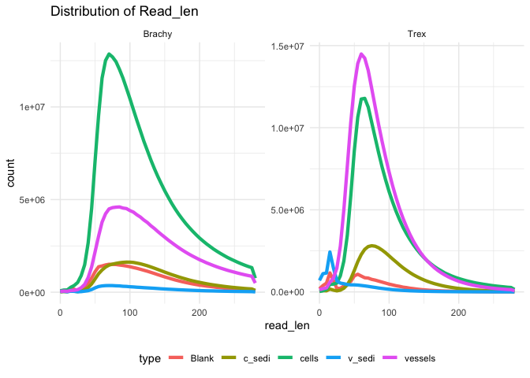

## Trimmed and Pair-Merged Read Lengths

-   Reads were merged using LeeHom

## BWA Best Scores

<figure>

<figcaption aria-hidden="true">bwa_score</figcaption>
</figure>

## Kraken2 Contamination Report

<table>
<caption>Kraken report: domain proportions by sample</caption>
<colgroup>
<col style="width: 21%" />
<col style="width: 13%" />
<col style="width: 65%" />
</colgroup>
<thead>
<tr>
<th>Taxa</th>
<th style="text-align: center;">Included</th>
<th>Description</th>
</tr>
</thead>
<tbody>
<tr>
<td>Archaea</td>
<td style="text-align: center;">✅</td>
<td>Single-celled microorganisms distinct from bacteria</td>
</tr>
<tr>
<td>Bacteria</td>
<td style="text-align: center;">✅</td>
<td>Prokaryotic microorganisms</td>
</tr>
<tr>
<td>Human</td>
<td style="text-align: center;">✅</td>
<td>Host genome sequences</td>
</tr>
<tr>
<td>Plasmid</td>
<td style="text-align: center;">✅</td>
<td>Extrachromosomal DNA elements</td>
</tr>
<tr>
<td>Viral</td>
<td style="text-align: center;">✅</td>
<td>Viruses including phages</td>
</tr>
<tr>
<td>Fungi</td>
<td style="text-align: center;">✅</td>
<td>Eukaryotic organisms such as yeasts and molds</td>
</tr>
<tr>
<td>Protozoa</td>
<td style="text-align: center;">✅</td>
<td>Single-celled eukaryotes</td>
</tr>
<tr>
<td>UniVec</td>
<td style="text-align: center;">✅</td>
<td>Vector contamination sequences</td>
</tr>
<tr>
<td>UniVec_Core</td>
<td style="text-align: center;">✅</td>
<td>Core vector sequences</td>
</tr>
</tbody>
</table>

<table>
<colgroup>
<col style="width: 13%" />
<col style="width: 11%" />
<col style="width: 12%" />
<col style="width: 14%" />
<col style="width: 17%" />
<col style="width: 19%" />
<col style="width: 10%" />
</colgroup>
<thead>
<tr>
<th style="text-align: left;">sample</th>
<th style="text-align: right;">____Bacteria</th>
<th style="text-align: right;">____Eukaryota</th>
<th style="text-align: right;">______Bacillati</th>
<th style="text-align: right;">______Opisthokonta</th>
<th style="text-align: right;">______Pseudomonadati</th>
<th style="text-align: right;">classified</th>
</tr>
</thead>
<tbody>
<tr>
<td style="text-align: left;">Brachy_Blank</td>
<td style="text-align: right;">9.77</td>
<td style="text-align: right;">12.54</td>
<td style="text-align: right;">3.98</td>
<td style="text-align: right;">12.48</td>
<td style="text-align: right;">5.55</td>
<td style="text-align: right;">22.92</td>
</tr>
<tr>
<td style="text-align: left;">Brachy_c_sedi</td>
<td style="text-align: right;">13.13</td>
<td style="text-align: right;">1.38</td>
<td style="text-align: right;">3.58</td>
<td style="text-align: right;">1.37</td>
<td style="text-align: right;">8.77</td>
<td style="text-align: right;">14.75</td>
</tr>
<tr>
<td style="text-align: left;">Brachy_cells</td>
<td style="text-align: right;">16.74</td>
<td style="text-align: right;">0.00</td>
<td style="text-align: right;">6.97</td>
<td style="text-align: right;">0.00</td>
<td style="text-align: right;">8.75</td>
<td style="text-align: right;">17.08</td>
</tr>
<tr>
<td style="text-align: left;">Brachy_v_sedi</td>
<td style="text-align: right;">9.37</td>
<td style="text-align: right;">2.88</td>
<td style="text-align: right;">3.14</td>
<td style="text-align: right;">2.85</td>
<td style="text-align: right;">5.67</td>
<td style="text-align: right;">12.52</td>
</tr>
<tr>
<td style="text-align: left;">Brachy_vessels</td>
<td style="text-align: right;">17.42</td>
<td style="text-align: right;">0.00</td>
<td style="text-align: right;">8.16</td>
<td style="text-align: right;">0.00</td>
<td style="text-align: right;">8.29</td>
<td style="text-align: right;">18.44</td>
</tr>
<tr>
<td style="text-align: left;">Trex_ExtrBlank</td>
<td style="text-align: right;">10.07</td>
<td style="text-align: right;">38.32</td>
<td style="text-align: right;">4.54</td>
<td style="text-align: right;">38.20</td>
<td style="text-align: right;">5.29</td>
<td style="text-align: right;">49.29</td>
</tr>
<tr>
<td style="text-align: left;">Trex_c_sedi</td>
<td style="text-align: right;">6.55</td>
<td style="text-align: right;">5.15</td>
<td style="text-align: right;">1.18</td>
<td style="text-align: right;">5.13</td>
<td style="text-align: right;">5.25</td>
<td style="text-align: right;">11.99</td>
</tr>
<tr>
<td style="text-align: left;">Trex_cells</td>
<td style="text-align: right;">4.11</td>
<td style="text-align: right;">4.72</td>
<td style="text-align: right;">0.00</td>
<td style="text-align: right;">4.69</td>
<td style="text-align: right;">3.23</td>
<td style="text-align: right;">9.61</td>
</tr>
<tr>
<td style="text-align: left;">Trex_v_sedi</td>
<td style="text-align: right;">2.71</td>
<td style="text-align: right;">0.00</td>
<td style="text-align: right;">0.00</td>
<td style="text-align: right;">0.00</td>
<td style="text-align: right;">1.86</td>
<td style="text-align: right;">3.82</td>
</tr>
<tr>
<td style="text-align: left;">Trex_vessels</td>
<td style="text-align: right;">10.11</td>
<td style="text-align: right;">0.00</td>
<td style="text-align: right;">2.79</td>
<td style="text-align: right;">0.00</td>
<td style="text-align: right;">7.13</td>
<td style="text-align: right;">10.58</td>
</tr>
</tbody>
</table>

