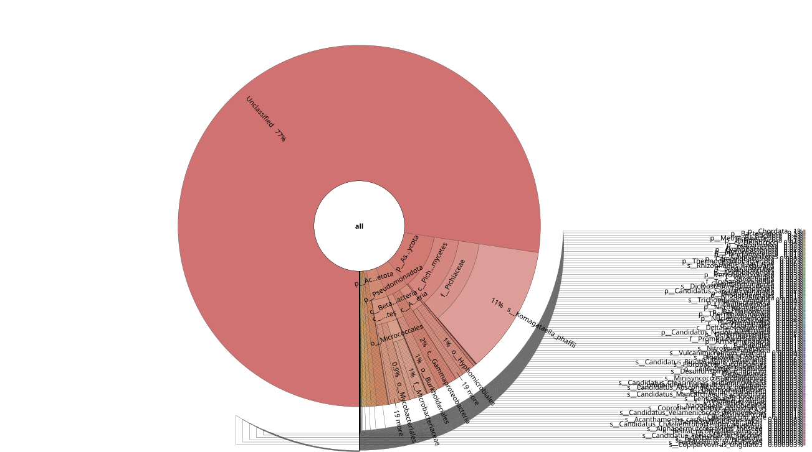
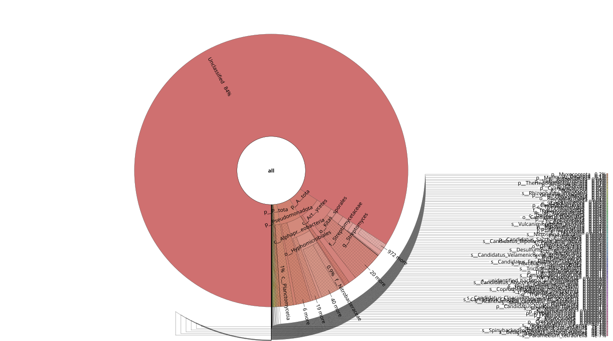

## Brachy Krona Visualization Dashboard (2025-11-05)

### Summary

We applied both k-mer–based (Kraken2) and alignment-based (Centrifuge)
approaches to assess the authenticity of putative dinosaur DNA. The
purpose of using additional Centrifuge is to allow partial and
mismatched alignments, enabling examination of sequences that remain
unclassified by exact k-mer matching. K-mer–based detection (Kraken2)
captures unmutated fragments, while alignment-based analysis
(Centrifuge) identifies reads related to modern or ancestral taxa
through partial homology. Notably, unclassified reads from blank
controls show ambiguous partial matches across multiple species, whereas
reads from cellular samples span a broader range of unknown or poorly
annotated organisms.

### Discussion Points

- [x] Generate Krona plots **without pruning** (previously, 1% fraction
  was used).  
- [x] Include **earlier dataset**: Brachy Cell SRSLY added.  
- [ ] Decompile **partial / multi-species data** (SAM output attempted
  but not working)
  - [ ] Extract reads under Archelosauria Taxanomy

### Input

LeeHom Trimmed, Merged FastQ
[link](https://github.com/hmgene/fossil-c/tree/main/results/2025-10-08-read-adapter-positions)

### K-mer w/ Kraken2 @ nt db

| File | Method | Link |
|----|----|----|
| Bracky_Blank | Kraken2 |  [View](https://raw.githack.com/hmgene/fossil-c/main/results/2025-11-05/brachy_blank_k2_nt.krona.html) |
| bracky_cells | Kraken2 |  [View](https://raw.githack.com/hmgene/fossil-c/main/results/2025-11-05/bracky_cells_k2_nt.krona.html) |

### (Partial \> 16 bp) Alignment w/ Centrifuge @ nt db

K-mer (Kraken2) identifies mutation-free fragments, while
alignment-based (Centrifuge) analysis reveals ancestral and modern
species sequences, with cells mapping to more unknown species than blank
samples.

``` r
library(readr)
library(knitr)

df <- read_csv("summ.csv")
```

    ## Rows: 11 Columns: 1
    ## ── Column specification ───────────────────────────────────────────────────────────────────────────────────────────────────
    ## Delimiter: ","
    ## chr (1): sample  top1    top2    top3    top4    top5
    ## 
    ## ℹ Use `spec()` to retrieve the full column specification for this data.
    ## ℹ Specify the column types or set `show_col_types = FALSE` to quiet this message.

``` r
kable(df, format = "markdown")
```

| sample top1 top2 top3 top4 top5                                   |
|:------------------------------------------------------------------|
| Trex_ExtrBlank Komagataella Homo Cyprinus uncultured Gossypium    |
| Brachy_Blank Pinus Komagataella Homo Cyprinus Mus                 |
| Trex_vessels Homo Mus Bradyrhizobium Pseudorhodoplanes Spirometra |
| Trex_c_sedi Homo Komagataella Alternaria Mus Cyprinus             |
| BC_SRSLY Cyprinus Homo Mycobacterium Tarenaya Mycobacterium       |
| Trex_v_sedi Cyprinus Homo Mus Komagataella Spirometra             |
| Trex_cells Komagataella Homo Pinus Mus Cyprinus                   |
| Brachy_vessels Homo Mus uncultured Cyprinus Oryzias               |
| Brachy_v_sedi Komagataella Homo Cyprinus uncultured Mus           |
| Brachy_c_sedi Komagataella Homo Mus Cyprinus uncultured           |
| Brachy_cells Homo uncultured Mus Spirometra Burkholderia          |

details:

[BC_SRSLY.krona.html](https://raw.githack.com/hmgene/fossil-c/main/results/2025-11-05/BC_SRSLY.krona.html)  
[brachy_blank_k2_nt.krona.html](https://raw.githack.com/hmgene/fossil-c/main/results/2025-11-05/brachy_blank_k2_nt.krona.html)  
[bracky_blank_cf_nt.krona.html](https://raw.githack.com/hmgene/fossil-c/main/results/2025-11-05/bracky_blank_cf_nt.krona.html)  
[bracky_cells_cf_nt.krona.html](https://raw.githack.com/hmgene/fossil-c/main/results/2025-11-05/bracky_cells_cf_nt.krona.html)  
[bracky_cells_k2_nt.krona.html](https://raw.githack.com/hmgene/fossil-c/main/results/2025-11-05/bracky_cells_k2_nt.krona.html)  
[bracky_csedi.krona.html](https://raw.githack.com/hmgene/fossil-c/main/results/2025-11-05/bracky_csedi.krona.html)  
[bracky_vessels.krona.html](https://raw.githack.com/hmgene/fossil-c/main/results/2025-11-05/bracky_vessels.krona.html)  
[bracky_vsedi.krona.html](https://raw.githack.com/hmgene/fossil-c/main/results/2025-11-05/bracky_vsedi.krona.html)  
[trex_blank.krona.html](https://raw.githack.com/hmgene/fossil-c/main/results/2025-11-05/trex_blank.krona.html)  
[trex_cells.krona.html](https://raw.githack.com/hmgene/fossil-c/main/results/2025-11-05/trex_cells.krona.html)  
[trex_vessels.krona.html](https://raw.githack.com/hmgene/fossil-c/main/results/2025-11-05/trex_vessels.krona.html)  
[trex_vsedi.krona.html](https://raw.githack.com/hmgene/fossil-c/main/results/2025-11-05/trex_vsedi.krona.html)
