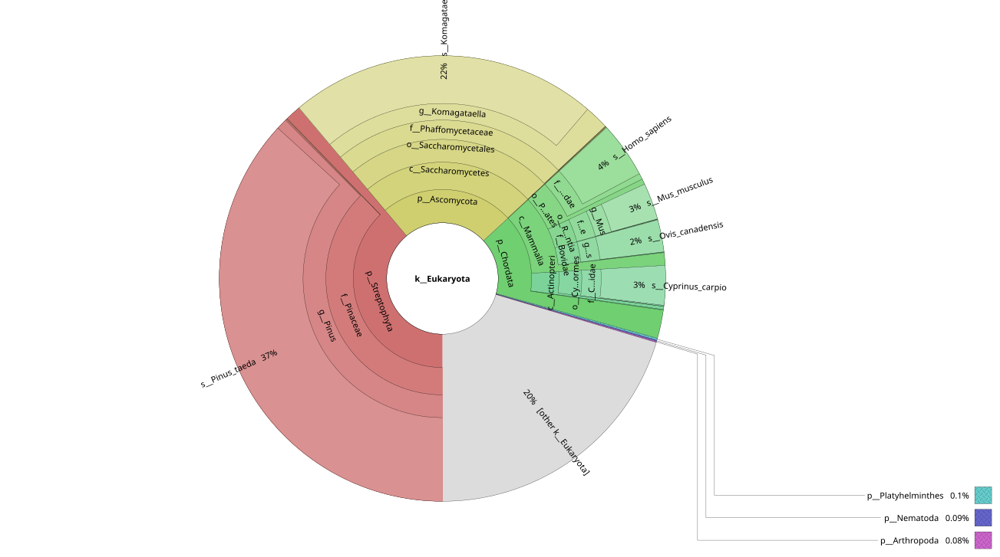
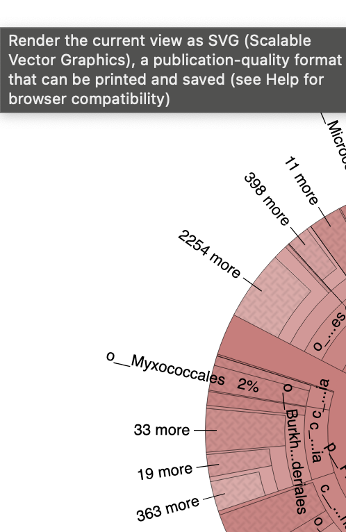

## Brachy Krona Visualization Dashboard (2025-11-05)

### Summary
We applied both k-mer–based (Kraken2) and alignment-based (Centrifuge) approaches to assess the authenticity of putative dinosaur DNA.
The purpose of using additional Centrifuge is to allow partial and mismatched alignments, enabling examination of sequences that remain unclassified by exact k-mer matching.
K-mer–based detection (Kraken2) captures unmutated fragments, while alignment-based analysis (Centrifuge) identifies reads related to modern or ancestral taxa through partial homology.
Notably, unclassified reads from blank controls show ambiguous partial matches across multiple species, whereas reads from cellular samples span a broader range of unknown or poorly annotated organisms.

### Input
LeeHom Trimmed, Merged FastQ [link](https://github.com/hmgene/fossil-c/tree/main/results/2025-10-08-read-adapter-positions)

### K-mer w/ Kraken2 @ nt db

| File | Method | Link |
|------|-------|------|
| Bracky_Blank | Kraken2 |  [View](https://raw.githack.com/hmgene/fossil-c/main/results/2025-11-05/brachy_blank_k2_nt.krona.html) |
| bracky_cells | Kraken2 | [View](https://raw.githack.com/hmgene/fossil-c/main/results/2025-11-05/bracky_cells_k2_nt.krona.html) |

### (Partial > 16 bp) Alignment w/ Centrifuge @ nt db

K-mer (Kraken2) identifies mutation-free fragments, while alignment-based (Centrifuge) analysis reveals ancestral and modern species sequences, with cells mapping to more unknown species than blank samples.

| File | Method | Link | Eukarota |
|------|-------|------|------|
| bracky_blank | Centrifuge |  [View](https://raw.githack.com/hmgene/fossil-c/main/results/2025-11-05/bracky_blank_cf_nt.krona.html) |   |
| bracky_cells | Centrifuge |  [View](https://raw.githack.com/hmgene/fossil-c/main/results/2025-11-05/bracky_cells_cf_nt.krona.html) |  |
| BC_SRSLY | Centrifuge | [View](https://raw.githack.com/hmgene/fossil-c/main/results/2025-11-05/BC_SRSLY.krreport.txt.krona.html) |
