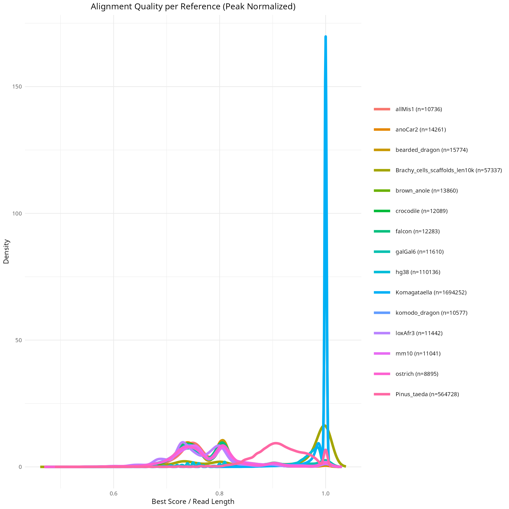
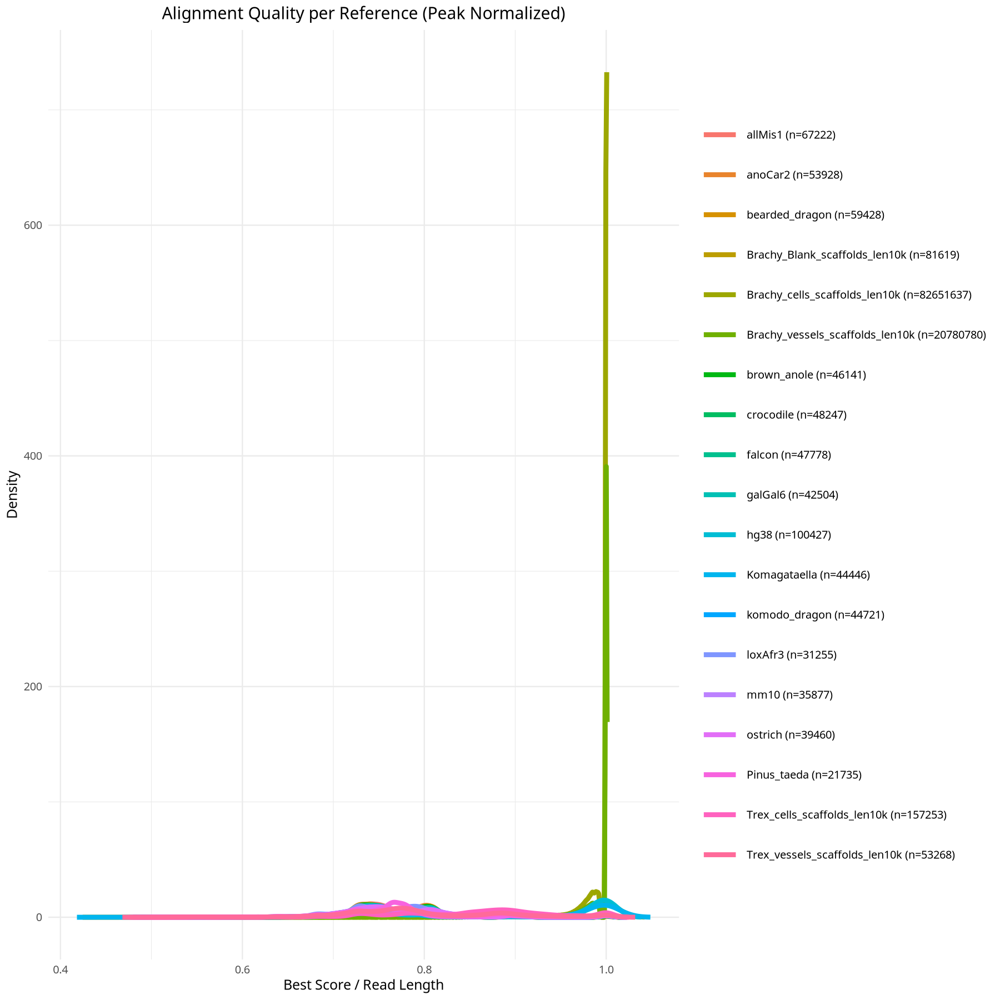

## Discussion Points

-   ☒ : Quantify the proportion of reads mapped for Brachy\_Blank and
    Brachy\_cells in human and other species.
-   ☒ : Contig Distributions in Bracky\_Blank vs. Bracky\_Cells
    -   ☐ : This approach may necessitate species pre-classification
        instead of performing redundant post-identification.

## Results

-   Data: bigdata/bwa\_scores/\*.tsv files on HPC
    -   example :

    <!-- -->

        id  seq Brachy_cells@allMis1    Brachy_cells@anoCar2    Brachy_cells@bearded_dragon Brachy_cells@brown_anole    Brachy_cells@crocodile  Brachy_cells@falcon Brachy_cells@galGal6    Brachy_cells@hg38   Brachy_cells@komodo_dragon  Brachy_cells@loxAfr3    Brachy_cells@mm10   Brachy_cells@ostrich
        LH00333:151:232G25LT3:2:2167:33774:18886    TGGCCCCGGAAGTCGTCGGC    0   0   0   0   0   0   0   0   0   0   16  0
        LH00333:151:232G25LT3:2:2176:26174:11745    AAATTTTGCTAAGGATATTTGCGTCAATTTTTATGAAGATTTTATCAAGAATATGGGTTGTAGTTTTCCATTATGATGTCTTTGTTGGAGTAATGCTGGCCT  0   102 0   0   0   0
        LH00333:151:232G25LT3:2:1172:50091:21945    CGACAGCGTCGTGACAGCTTC   0   0   0   0   0   0   0   0   0   0   17  17
-   Method :
    -   Bwa Alignment (aDNA fit) [code](../../02-bwa-rn.sh)
    -   Considered Species : allMis1 anoCar2 bearded\_dragon
        brown\_anole crocodile galGal6 hg38 komodo\_dragon loxAfr3 mm10
        ostrich
    -   Best Scoring [code](../../03-bwa-pl.sh)
    -   Score calculation:
        score = matches − mismatches − gap\_initiation

### Alignment Length Proportions

<table>
<thead>
<tr>
<th>Sample</th>
<th>Total Reads</th>
<th>Reads Merged</th>
<th>Merged Reads</th>
<th>Aligned</th>
</tr>
</thead>
<tbody>
<tr>
<td>Bracky_Blank</td>
<td>91592712</td>
<td>75539044</td>
<td>37769522</td>
<td>2559021</td>
</tr>
<tr>
<td>Bracky_cells</td>
<td>675698180</td>
<td>557543426</td>
<td>278771713</td>
<td>83688488</td>
</tr>
<tr>
<td>Bracky_vessels</td>
<td>327279862</td>
<td>315134305</td>
<td>157567152</td>
<td>29292117</td>
</tr>
</tbody>
</table>

<table>
<colgroup>
<col style="width: 50%" />
<col style="width: 50%" />
</colgroup>
<thead>
<tr>
<th>Brachy Blank</th>
<th>Brachy Cells</th>
</tr>
</thead>
<tbody>
<tr>
<td></td>
<td></td>
</tr>
</tbody>
</table>

[Bracky\_Blank table](data/alignment_proportion_Brachy_Blank.csv.gz)
[Bracky\_cells table](data/alignment_proportion_Brachy_cells.csv.gz%22)

-   In the cell samples, Human(118350) and AllMis1(98404) are the top
    two mapped taxa,.
-   Human and Komataella (yeast) show ~ 100% aligned/read-length
    proportions.
-   In the blank samples, the majority of reads map to
    Komataella (1694742) and Pinus taeda (565081), with 80~100%
    aligned/read-length proportions.

### Contig/Scaffold Lengths – SPAdes (Merged Single-End Reads)

> Scaffolds and contigs are identical in the bracky\_blank. Assembly of
> contigs for the bracky\_cell sample is not yet complete.

<figure>

<figcaption aria-hidden="true">png</figcaption>
</figure>
